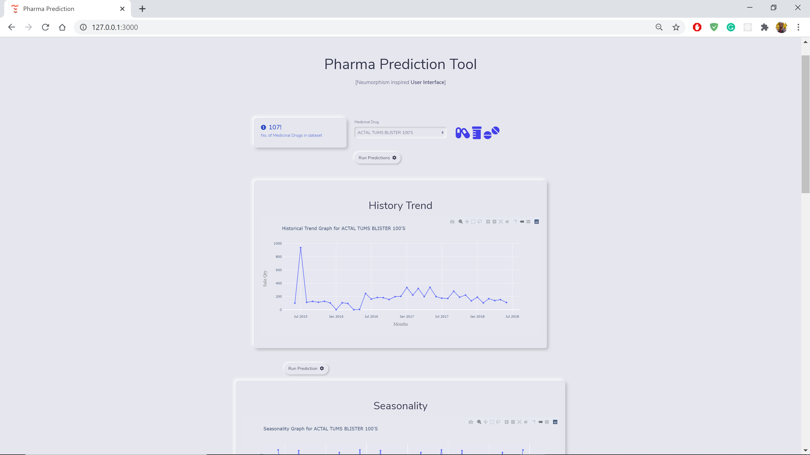
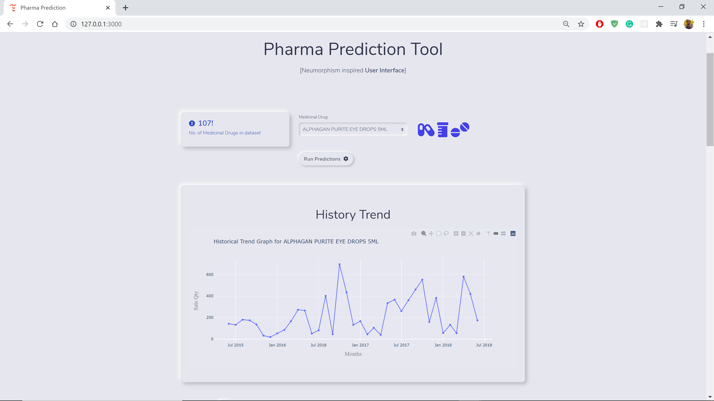
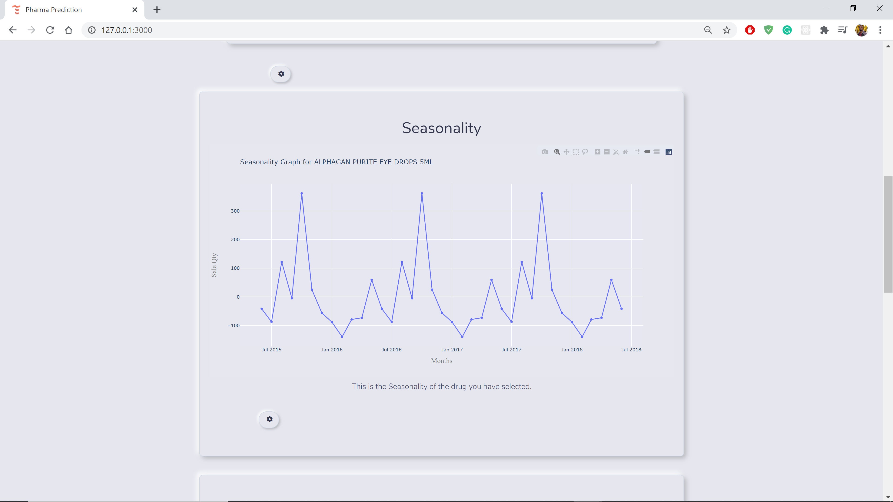
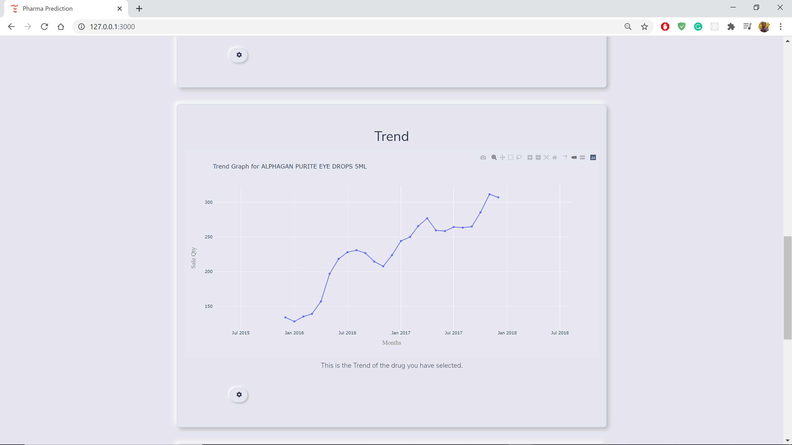
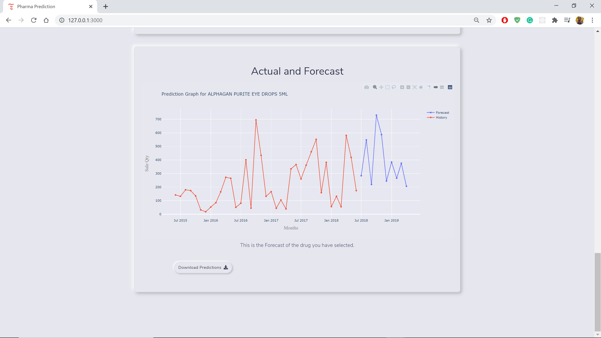

# Pharma-Prediction-App

The Pharma-Prediction App is a machine learning application deployed using Python-Flask, and the 2020 Neumorphism UI. 

## What does it do?
The app utilizes data science processes to clean and transform the original dataset. It performs decomposition of the data from each medicine's records. From the decomposition we 
get the seasonality and trend of the sales of a specific medicine. Once this is done, the app can be prompted to predict the future values of the selected medicinal drug.

## User Interface
The app deployment front-end is built using the trending Neumorphism style. It is designed to have a lab/medical feel and interacting with the UI components gives a smooth experience for the user.
The choice colors are intentional to create a medical/laboratory feel.

Below are the screenshots

### The App UI at a Glance

### The History Section

Here you are able to view the historical data of the selected medicinal drug - how it has recorded its sales over time.
You can hover over the graph to view the respective values of the months in the record.

### The Seasonality Section

In this section, you are able to view the seasonal decomposition of the selected medicinal drug - how its sales cycle or react over time, and its season.
You can hover over the graph to view the respective values of the months in the record.

### The Trend Section

Here the grap shows the trend of the sales of the selected medicinal drug over time.
You can hover over the graph to view the respective values of the months in the record.

### The Actual to Forecast Section

This is the meat of the app. The app gets the predictions for the sale of the selected drug, and visualizes it together with the history records.

## Prediction Algorithm
As of now, the app uses ARIMA. Evaluating the Mean Squared Error and Root Mean Squared Error pits the used model as good for this use case.

## Software Engineering Practices: Modularization
The code in this app has been modularized i.e. has been divided into modules for splitting data, seasonality, processing, the model, and predictions run. The modules are imported for use across different modules.

## How to Run
  1. Clone or download the repository.
  2. `cd` into the `app/model` directory.
  3. Run `pip install -r requirements.txt`
  4. Once done, in a terminal, run `python app.py`
  5. `Ctrl+click` the address in the terminal.
  
